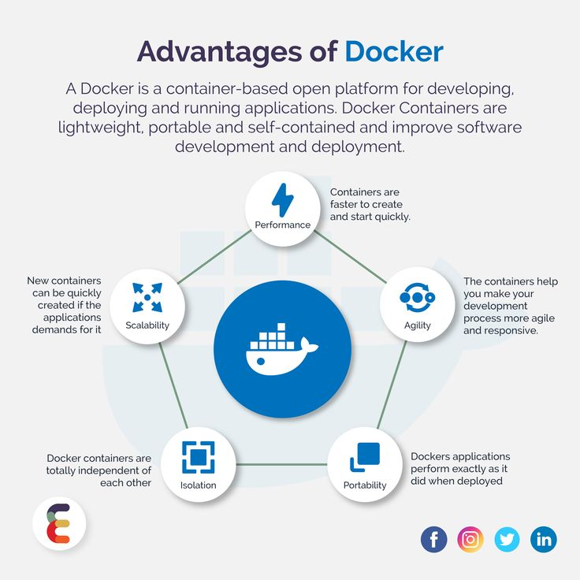

# DOCKER OVERVIEW
 

 * **what is a container?**

A container is a standard unit of software that packages up code and all its dependencies, so the application runs quickly and reliably from one computing environment to another. allow a developer to package up an application with all the parts it needs, such as libraries and other dependencies, and deploy it as one package.

* **Docker Achitecture?** 

 

* ** Docker Objects?**

  When you use Docker, you are creating and using images, containers, networks, volumes, plugins, and other objects. This section is a brief overview of some of those objects.

* **What is the benefit of using Docker?** 

Docker uses fewer resources compared to traditional virtual machines. Because containers share the same underlying operating system kernel, they are much lighter and require less disk space and RAM. This allows more applications to run on a single machine, which saves hardware costs and eases resource management. 

 

